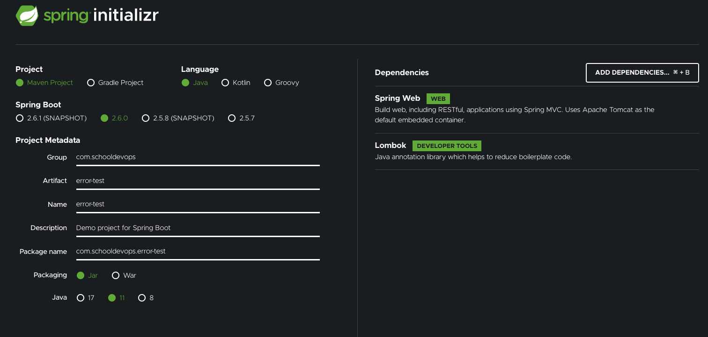
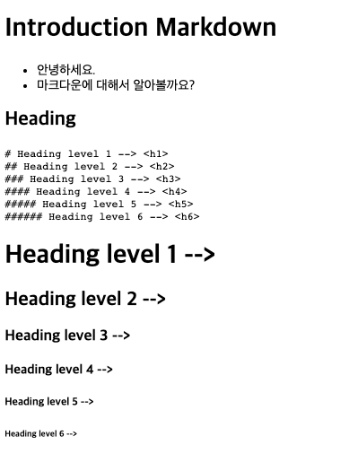

# SpringBoot Web 에서 Markdown 출력하기. 

- 스프링 부트로 어플리케이션을 개발하면서, 마크다운 을 이용하여 메뉴얼을 작성해야할 일이 생겼다. 
- 이로 인해서 마크다운 문서를 뷰잉 해 보도록 하자. 

##  프로젝트 생성하기. 

https://start.spring.io 에서 다음과 같이 프로젝트를 만들자. 



## 의존성 파일 다운로드. 

markdown 을 파싱해서 html 으로 변환해 주는 라이브러리가 있다. 

commonmark-java 가 그것인데, 다음 [github](https://github.com/commonmark/commonmark-java) 에서 내용을 확인할 수 있다. 

```xml
        <dependency>
            <groupId>org.commonmark</groupId>
            <artifactId>commonmark</artifactId>
            <version>0.18.0</version>
        </dependency>
```

우리는 Thymeleaf도 사용할 것이므로 다음 의존성도 추가하자. 

```xml
		<dependency>
			<groupId>org.springframework.boot</groupId>
			<artifactId>spring-boot-starter-thymeleaf</artifactId>
		</dependency>
```

## 기본 사용법 

메뉴얼 페이지에 따르면 다음과 같은 기본적인 변환 예제를 확인할 수 있다. 

```java
import org.commonmark.node.*;
import org.commonmark.parser.Parser;
import org.commonmark.renderer.html.HtmlRenderer;

... 생략 
        
Parser parser = Parser.builder().build();
Node document = parser.parse("This is *Sparta*");
HtmlRenderer renderer = HtmlRenderer.builder().build();
renderer.render(document);  // "<p>This is <em>Sparta</em></p>\n"

--- 생략 
```

위 내용을 확인해 보면, `This is *Sparta*` 라는 입력에 대해서 결과는   `<p>This is <em>Sparta</em></p>\n` 로 변환된 것을 알 수 있다. 

## 뷰어 코드 사용하기. 

이제 위 코드를 간단히 확인해 봤으니, 메뉴얼 페이지를 작성해 보자. 

- 마크다운 소스파일은 src/main/resources/static/manuals 디렉토리에 만들 것이다. 
- 마크다운 뷰를 위해서 /view/{markdown_file_name.md} 로 URI경로를 지정하면 파일을 읽어 화면에 노출 할 것이다. 

## 컨틀로러 생성하기. 

- 이제 컨트롤러를 생성해보자. 

MarkdonwController.java 파일을 다음과 같이 작성하자. 

```java
package com.schooldevops.errortest;

import lombok.extern.slf4j.Slf4j;
import org.commonmark.node.Node;
import org.commonmark.parser.Parser;
import org.commonmark.renderer.html.HtmlRenderer;
import org.springframework.core.io.ClassPathResource;
import org.springframework.stereotype.Controller;
import org.springframework.ui.Model;
import org.springframework.web.bind.annotation.GetMapping;
import org.springframework.web.bind.annotation.PathVariable;

import java.io.BufferedReader;
import java.nio.file.Files;
import java.nio.file.Paths;

@Slf4j
@Controller
public class MarkdownController {

    private final static String LOCAL_MANUAL_PATH = "static/manuals/";

    @GetMapping("/view/{page}")
    public String markdownView(@PathVariable("page") String page, Model model) throws Exception {

        String markdownValueFormLocal = getMarkdownValueFormLocal(page);

        Parser parser = Parser.builder().build();
        Node document = parser.parse(markdownValueFormLocal);
        HtmlRenderer renderer = HtmlRenderer.builder().build();

        model.addAttribute("contents", renderer.render(document));

        return "view";
    }

    public String getMarkdownValueFormLocal(String manualPage) throws Exception {
        StringBuilder stringBuilder = new StringBuilder();
        ClassPathResource classPathResource = new ClassPathResource(LOCAL_MANUAL_PATH + manualPage);

        BufferedReader br = Files.newBufferedReader(Paths.get(classPathResource.getURI()));
        br.lines().forEach(line -> stringBuilder.append(line).append("\n"));

        return stringBuilder.toString();
    }
}

```

- LOCAL_MANUAL_PATH
  - 마크다운 이 존재하는 위치를 classpath 기준으로 작성했다. 
- GetMapping 
  - 마크다운 페이지 요청을 `/view/<markdown_file_name.md>` 형식으로 받아들인다 .
  - 이때 `/view/{page}` 에서 page는 파일 이름이며, 패스 값으로 전달받는다. 
- getMarkdownValueFormLocal 은 마크다운 파일을 읽어 들인다. 
- 이후 읽어들인 내용을 마크다운으로 변환한다. 

### 마크다운 파일 읽기 

```java
    public String getMarkdownValueFormLocal(String manualPage) throws Exception {
        StringBuilder stringBuilder = new StringBuilder();
        ClassPathResource classPathResource = new ClassPathResource(LOCAL_MANUAL_PATH + manualPage);

        BufferedReader br = Files.newBufferedReader(Paths.get(classPathResource.getURI()));
        br.lines().forEach(line -> stringBuilder.append(line).append("\n"));

        return stringBuilder.toString();
    }
```

- 보는바와 같이 ClassPathResource 를 읽었다. 이는 `/src/main/resources` 를 기준으로 파일을 읽어 들인다.
- 그러므로 경로 이름은 static/manuals/filename.md 로 파라미터를 주면 된다. 
- Files.newBufferedReader 를 이용하여 파일에서 라인별로 읽어 StringBuilder에 추가한다. 
- 최종적으로는 파일 내용을 스트링으로 만들어 반환한다. stringBuilder.toString() 이 그것이다. 

## 마크다운 변환하기. 

다음은 읽은 파일을 마크다운으로 변환한다. 

```java
        Parser parser = Parser.builder().build();
        Node document = parser.parse(markdownValueFormLocal);
        HtmlRenderer renderer = HtmlRenderer.builder().build();

        model.addAttribute("contents", renderer.render(document));
        
```

- HtmlRenderer 을 생성하고, 마크다운을 랜더링 하면, HTML 컨텐츠를 반환하게 된다. 

## View 파일 작성하기. 

우리는 메뉴얼을 노출하기 위해서 thymeleaf 를 이용한다. 

이를 위해서 resources/templates 디렉토리에 view.html 파일을 만들고 다음과 같이 작성했다. 

```html
<!DOCTYPE HTML>
<html lang="en" xmlns:th="http://www.thymeleaf.org">
<head>
    <meta charset="utf-8">
    <meta name="viewport" content="width=device-width, initial-scale=1, shrink-to-fit=no">

    <title>Markdown Viewer</title>

</head>

<body>

<main role="main" class="container">

    <div class="starter-template">
        <div th:utext="${contents}"></div>
    </div>

</main>

</body>
</html>
```

여기서 중요한 부분은 `th:utext="${contents}` 부분이다. 

tx:utext 는 텍스트를 표시할때 이스케이프 처리를 하지 않고 그대로 화면에 노출할때 사용한다. 

즉 html 태그등을 그대로 출력해서 html로 동작하도록 만들어 주는 것이다. 

## 마크다운 파일 작성하기. 

처음 이야기한대로 마크다운 파일을 `resources/static/manuals` 디렉토리내에 intro.md 라는 파일로 작성했다. 

```markdown
# Introduction Markdown

- 안녕하세요. 
- 마크다운에 대해서 알아볼까요? 

##  Heading

'''
# Heading level 1 --> <h1>
## Heading level 2 --> <h2>
### Heading level 3 --> <h3>
#### Heading level 4 --> <h4>
##### Heading level 5 --> <h5>
###### Heading level 6 --> <h6>
'''

# Heading level 1 --> <h1>

## Heading level 2 --> <h2>

### Heading level 3 --> <h3>

#### Heading level 4 --> <h4>

##### Heading level 5 --> <h5>

###### Heading level 6 --> <h6>

```

## 실행 하기. 

이제 실행결과를 확인해 보자. 

브라우저에서 http://localhost:8080/view/intro.md 라고 입력하면 다음과 같은 결과를 확인할 수 있다. 



우리가 원하는 결과가 나왔다. 

참고로 여기에 bootstrap 등과 같은 css framework 를 입히면 한결 보기좋은 결과를 얻을 수 있다. 
